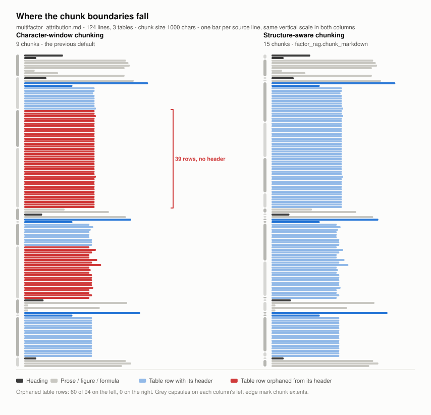
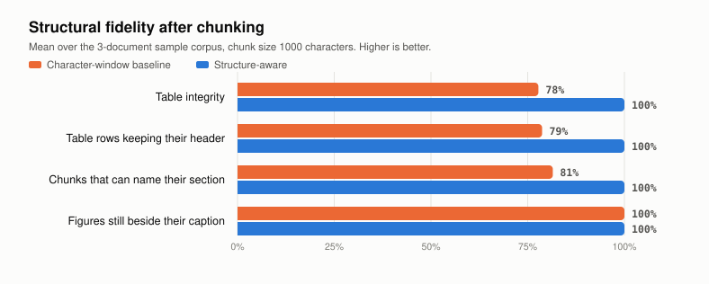

<div align="center">

# factor-rag

**Chunk the tables, not through them.**

Structure-aware Markdown chunking for RAG over visually rich documents —
so a 48-row financial table stops arriving at your model cut in half and missing its header.

[](https://www.python.org/)
[](LICENSE)
[](tests/)
[](#install)

</div>

---

## The problem

Run a PDF through a layout parser — MinerU, Marker, Nougat, PP-StructureV2 — and what
comes out is mostly *structure*: pipe tables, figure references, formulas, headings.

Then a character-window chunker cuts it every 1000 characters and the structure is gone.

<picture>
  <source media="(prefers-color-scheme: dark)" srcset="assets/structure-map-dark.svg">
  
</picture>

Every red bar is a table row that landed in a chunk **without its header**. It is
simultaneously unretrievable — no lexical signal left, just `| 0.31 | 0.08 |` — and
unusable, because no model can read a headerless table. On the bundled corpus that is
**60 of 94 table rows** — the two longest tables in the document are almost entirely orphaned.

## The fix

`chunk_markdown()` parses the document into semantic blocks first, then packs them:

| Guarantee | What it means |
|---|---|
| **Tables never lose their header** | An oversized table splits by rows, and the header row is repeated in every part |
| **Fences stay balanced** | A code or formula block is never cut mid-fence |
| **Figures keep their captions** | An image reference and its caption stay in one chunk |
| **Every chunk knows its section** | The heading breadcrumb is attached as text *and* metadata |
| **It terminates** | The previous character-window splitter could move its cursor backwards and loop forever |
| **Ids are deterministic** | SHA-1 of content and provenance, not salted `hash()` — so re-indexing updates instead of duplicating |

## Measured, not asserted

<picture>
  <source media="(prefers-color-scheme: dark)" srcset="assets/fidelity-dark.svg">
  
</picture>

| Metric | Character-window | Structure-aware |
|---|---|---|
| Table integrity | 78% | **100%** |
| Table rows keeping their header | 79% | **100%** |
| Chunks that can name their section | 81% | **100%** |
| Figures still beside their caption | 100% | **100%** |

Mean over the 3-document sample corpus at `chunk_size=1000`. Reproduce from a clean clone:

```bash
python benchmarks/run_benchmark.py
```

No model, no API key, no GPU — the corpus is in [`samples/`](samples/) and the metrics
are computed from chunk text alone, so any chunker can be scored on equal terms.

## Install

The chunker has **no heavy dependencies** — no torch, no vLLM, no LangChain:

```bash
pip install -e .
```

For the full retrieval pipeline:

```bash
pip install -e ".[rag]"
```

## Use

Chunking alone, which is what most people want:

```python
from factor_rag import chunk_markdown

chunks = chunk_markdown(open("report.md", encoding="utf-8").read(),
                        source="report.md", chunk_size=1000)

for c in chunks:
    print(c.metadata["heading_path"], c.metadata["has_table"], len(c.text))
```

Chunk metadata is flat scalars, so it goes straight into Chroma, FAISS or Qdrant with
no flattening step.

Score any chunking strategy against the structure in the source:

```python
from factor_rag import score_chunks, naive_chunk

report = score_chunks(markdown, naive_chunk(markdown, 1000, 200))
print(report.table_integrity, report.row_header_coverage)
```

Full pipeline:

```python
from factor_rag.rag_system import RAGSystem

rag = RAGSystem()
rag.index_directory("docs/")
print(rag.query("What was the break-even transaction cost?"))
```

Set `OPENROUTER_API_KEY` in the environment first. Configuration is environment-driven
(`FACTOR_RAG_HOME`, `FACTOR_RAG_CHUNK_SIZE`, `FACTOR_RAG_TOP_K`, ...); see
[`factor_rag/config.py`](factor_rag/config.py).

## What changed in 0.2

This release is a repair as much as a feature. The 0.1 package could not be imported at
all: `utils/document_processor.py` did `from ..config import ...` while the top-level
package name contained a hyphen, and `models/llm_model.py` imported `langchain_openrouter`,
which does not exist on PyPI. Alongside the new chunker, 0.2 fixes the non-terminating
splitter, the process-salted document ids, the `except ValueError` that could not catch
Chroma's `NotFoundError`, the vLLM embedding output being read as a raw vector, and the
hardcoded `/root/autodl-fs` paths that were created as an import side effect.

## Layout

```
factor_rag/
  chunking.py     structure-aware chunker           (no dependencies)
  metrics.py      structural-fidelity scoring       (no dependencies)
  viz.py          SVG figures                       (no dependencies)
  config.py       environment-driven settings
  document_processor.py / vector_db.py / models/ / rag_system.py
benchmarks/       reproducible measurement + figure generation
samples/          synthetic VRD-converted corpus
tests/            17 invariant tests
```

## Citation

```bibtex
@software{lin_factor_rag,
  author  = {Lin, Zeteng},
  title   = {factor-rag: Structure-Aware Chunking for Retrieval over Visually Rich Documents},
  year    = {2026},
  url     = {https://github.com/Lam810/factor_mining-rag}
}
```

## License

MIT — see [LICENSE](LICENSE).

Built by **Zeteng Lin** (林泽腾), Ph.D. candidate in Data Science and Analytics,
Information Hub, The Hong Kong University of Science and Technology (Guangzhou).
[lam810.github.io](https://lam810.github.io/)
